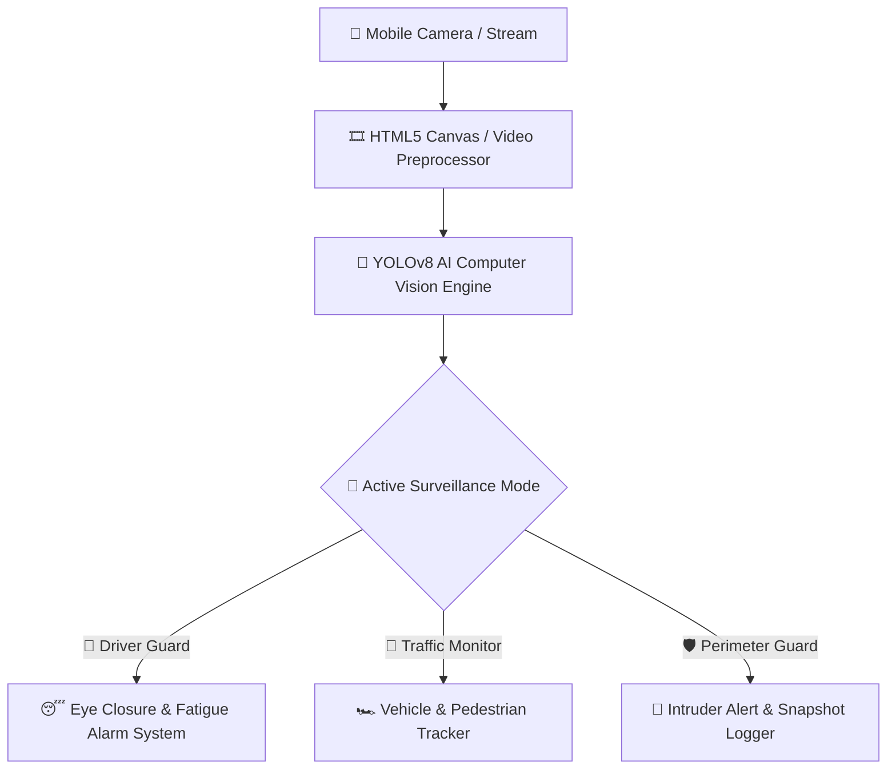
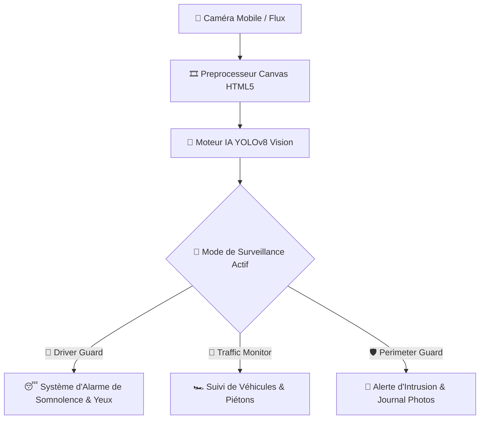

# VisionGuard AI Mobile 📱👁️

<div align="center">
  <h3>Mobile Computer Vision, Driver Safety & Perimeter Surveillance</h3>
  <p><em>Vision par Ordinateur Mobile, Sécurité du Conducteur & Surveillance</em></p>

  <br />
  
  <!-- Demonstration Banner -->
  <div style="border: 1px solid rgba(255,255,255,0.2); border-radius: 12px; padding: 10px; background: rgba(0,0,0,0.5);">
    
    <p><sub>🎬 <b>Demonstration / Aperçu Visuel :</b> Remplacez <code>preview.gif</code> par la vraie démo animée du projet.</sub></p>
  </div>

  <br />
      
</div>

---

<details open>
  <summary><b>📌 Table of Contents / Table des matières</b></summary>
  <ul>
    <li><a href="#-english">🇬🇧 English</a></li>
    <ul>
      <li><a href="#-about-the-project">About the Project</a></li>
      <li><a href="#-architecture--data-flow">Architecture & Data Flow</a></li>
      <li><a href="#-key-features">Key Features</a></li>
      <li><a href="#-getting-started">Getting Started</a></li>
    </ul>
    <li><a href="#-français">🇫🇷 Français</a></li>
    <ul>
      <li><a href="#-à-propos-du-projet">À propos du projet</a></li>
      <li><a href="#-architecture--flux-de-données">Architecture & Flux de données</a></li>
      <li><a href="#-fonctionnalités-clés">Fonctionnalités clés</a></li>
      <li><a href="#-démarrage-rapide">Démarrage rapide</a></li>
    </ul>
    <li><a href="#-license--licence">📜 License / Licence</a></li>
  </ul>
</details>

---

## 🇬🇧 English

### 📖 About the Project
VisionGuard AI Mobile is a real-time mobile computer vision and surveillance application featuring camera stream ingestion, driver drowsiness detection, object tracking, acoustic/haptic hazard alerts, and PWA mobile installation.

### 🏗️ Architecture & Data Flow


### ✨ Key Features
- 🚗 **Driver Drowsiness Guard**: Real-time eye tracking with acoustic and vibration alarms
- 🚦 **Traffic & Pedestrian Monitor**: 60 FPS object tracking and speed analytics
- 🛡️ **Perimeter Intrusion Detector**: Motion scanner with instant snapshot export
- 📱 **Installable PWA**: Standalone fullscreen mobile experience on iOS & Android

### 💻 Getting Started
To run this project locally:
```bash
start_visionguard.bat
```

---

## 🇫🇷 Français

### 📖 À propos du projet
VisionGuard AI Mobile est une application mobile de vision par ordinateur et de surveillance en temps réel proposant le suivi par caméra, la détection de somnolence du conducteur, le suivi d'objets, des alertes sonores/haptiques et le support PWA.

### 🏗️ Architecture & Flux de données


### ✨ Fonctionnalités clés
- 🚗 **Anti-Somnolence Conducteur**: Suivi du regard en direct avec alarme sonore et vibration
- 🚦 **Surveillance du Trafic**: Suivi d'objets et véhicules à 60 images par seconde
- 🛡️ **Protection de Périmètre**: Détection d'intrusions avec capture d'écran horodatée
- 📱 **PWA Installable**: Expérience d'application autonome plein écran sur iOS et Android

### 💻 Démarrage rapide
Pour démarrer ce projet localement :
```bash
start_visionguard.bat
```

---

## 📜 License / Licence
Distributed under the MIT License. Copyright © 2026 **Ricardo Ratovoarisoa**. All rights reserved.

---
<div align="center">
  <sub>Built with ❤️ by <b>Ricardo Ratovoarisoa</b> | AI & Full-Stack Developer</sub>
</div>
